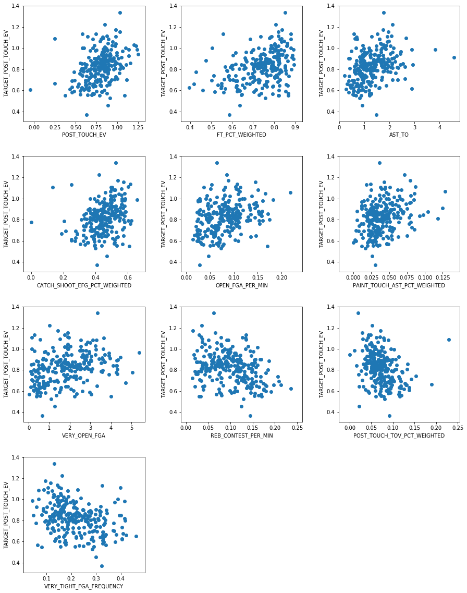

# Technical Report
## Problem Statement

Every NBA team, fan, and analyst wants to know how well a players will play together. Since the answer to the question is only actionable when looking forward, the first step is to understand how well a player will do in the future. Player performance is too often boiled down to a single number (RPM, BPM, PER, etc.) and this would not provide a step towards understanding how well players would play as teammates nor does it recognize the complex reality of player performance. In this project, I look to predict player performance and tendencies in different aspects of the game.  

Carefully choosing these aspects was the first step in creating useful predictions. Looking through the vasts amount of data provided by the [NBA's website](www.NBA.com/stats), I determined four categories to use: catch-and-shoot plays, pull-ups, drives, and post-ups. By including assist, turnover, and shooting data, I calculated the expected value, in points, and rate, in possessions used per minute, for each player over the last 5 seasons (what was available).  

## Data Collection
Data collection occurred throughout this project as I recognized the need for more and more statistics. Most statistics were taken from individual player data from the [NBA's website](www.NBA.com/stats) and some data required to calculate expected values of assists each year was taken from [Basketball-Reference](www.basketball-reference.com).  

I have stored all of the data in the [data folder](./data) in this repository. You can also look through the [scraping notebook](./Data%20Gathering.ipynb) to see what data sets I acquired them and how I did so.  

## Exploratory Data Analysis
#### Determining Target Features
The early data analysis was all meant to understand the possible targets for the model. There were 8 possible categories that I looked into: paint touches, elbow touches, post-ups, drives, catch-and-shoot plays, and pull-ups. Unfortunately, there was some overlap among these categories, and this project was to understand the different dimensions of a player. Having overlapping categories would potentially lead to overrating and/or underrating certain players. So, I went with as many categories as I could that were clearly not overlapping: post-ups, drives, catch-and-shoot plays, and pull-ups.

The next step was to understand from the data how I could value the outcome of these possessions. The shooting categories were pretty straightforward as they always end up in a shot. Effective field goal percentage (EFG%) is the expected points earned from a shot divided by the number of shots and then divided by two to make it comparable to field goal percentage. By multiplying it by two we have the expected value of a pull-up shot or catch-and-shoot shot. Drives and post-ups were harder since only some of the times they end a possession and scoring, turnovers, and assists are all methods to ending the possession.

To calculate them, I needed to value shots, assists, and turnovers. I used points percentage to value shots which includes free throws as well as field goals. For assists, some creativity was required. There are no available stats on the number of passes a player makes from post-ups or drives that turn into shots and the value of those shots that do go in. I used the league average points per assisted shot for each year and a player's assist to potential assist ratio to determine the value of an assist. Turnovers are a little more simple. I used league average points off turnovers for each year to value them. The formulas are below.

$ EV(\text{AST}) = \dfrac{\text{3FGM}_{AST} * 3 + \text{2FGM}_{AST} * 2}{\text{FGM}_{AST}} = \dfrac{\frac{\text{3FGM}_{\text{AST}}}{\text{FGA}} * 3 + \frac{\text{2FGM}_{\text{AST}}}{\text{FGA}} * 2}{\frac{\text{FGM}_{\text{AST}}}{\text{FGA}}}$  

$ EV(\text{TO}) = \dfrac{\sum{PTS_{TO}}}{\sum{TO}} $

#### Valuing Target Features

The next step was determining the relationship of these target features with team performance. While this was not essential for the predictive modeling, it was necessary to interpreting the results. Looking at the graph below, you can see the correlation of the target features with DRTG (points allowed per 100 possessions), ORTG (points scored per 100 possessions), and win percentage. When interpreting the correlations from the table below, it is important to remember that each player is one fifth of the team.

All expected value categories were correlated with better offensive ratings and were significantly less correlated with defensive ratings. It will be important to remember that these stats are unrelated to defensive performance. Similarly, and likely because they are not very related to defense, they are not closely related to win percentage, although they do have positive correlation with it. Also, rates were much less correlated with ORTG and win percentage. Therefore, knowing how often a player does something should not be looked at on its own, but in combination with how well they do it.

Another important observation is that post-up expected value was the only category to have a negative correlation with DRTG (which is good). This could be because posting-up is related to other information like height which might influence rebounding and defense.

#### Post-Up Expected Value

Post-ups provided the challenge that most players rarely or never do it. It was important to establish a cut-off to limit the noise in the data, but this needed to be balanced with creating too small of a sample size. Using a cutoff of 50 post-ups a year, I found the 10 most correlated features with future expected value from post-ups. Below you can see the relationships. It should be noted that these categories are all related to how well a player scores near the hoop, passes, and avoids turnovers, but none are the actual expected value of post-ups from the current year.

## Modeling
#### Post-Up Expected Value
Using the features determined in the EDA, I applied a linear regression for maximum interpretability. The R2 score was .2 on the validation set and .1 on the test set. Below is a graph showing the most important features and their coefficients.

## Next Steps
Incorporating team data, to looking at how players work together.
